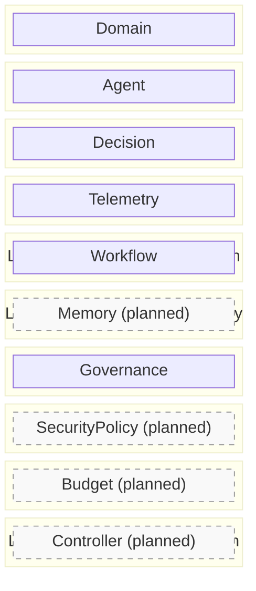
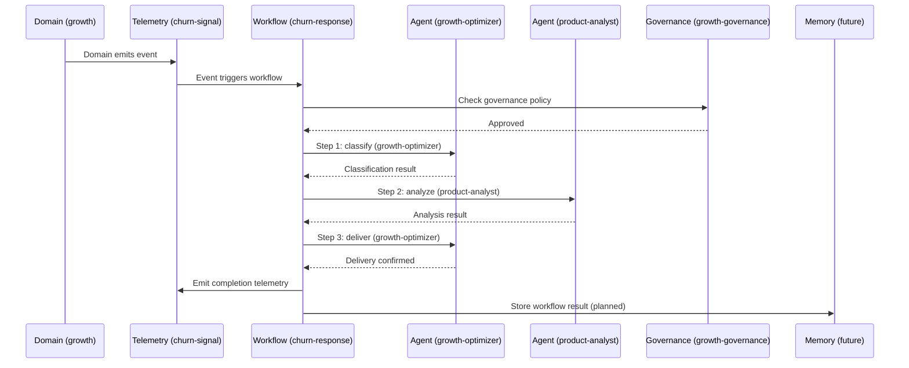

# IOA Resource Dependencies

Technical reference for cross-resource relationships in IOA v0.2.

---

## Resource Dependency Graph

```mermaid
flowchart TD
    %% Implemented resources (solid borders)
    Domain["Domain\n(Layer I)"]
    Agent["Agent\n(Layer II)"]
    Decision["Decision\n(Layer III)"]
    Telemetry["Telemetry\n(Layer IV)"]
    Workflow["Workflow\n(Layer V)"]
    Governance["Governance\n(Layer VII)"]
    Config["Config\n(Project)"]

    %% Planned resources (dashed borders)
    SecurityPolicy["SecurityPolicy\n(Layer VIII)"]:::planned
    Budget["Budget\n(Layer IX)"]:::planned
    Memory["Memory\n(Layer VI)"]:::planned
    Controller["Controller\n(Layer X)"]:::planned

    %% Implemented cross-references
    Agent -->|spec.domain| Domain
    Decision -->|spec.domain| Domain
    Decision -->|spec.relatedWorkflow| Workflow
    Telemetry -->|spec.source.domain| Domain
    Telemetry -->|spec.source.agent| Agent
    Governance -->|spec.domain| Domain
    Governance -->|spec.extends| Governance
    Workflow -->|spec.domainsInvolved| Domain
    Workflow -->|spec.steps[].agent| Agent
    Domain -->|spec.agents| Agent

    %% Planned cross-references (dashed lines)
    Domain -.->|spec.budgetRef| Budget
    Domain -.->|spec.securityPolicyRef| SecurityPolicy
    Memory -.->|spec.sourceAgent| Agent
    Memory -.->|spec.sourceDomain| Domain
    Controller -.->|spec.targetKind| Domain
    Controller -.->|spec.targetKind| Agent

    %% Styles
    classDef planned stroke-dasharray: 5 5, stroke:#999, fill:#f9f9f9
    classDef default fill:#d4edda, stroke:#28a745, color:#000
    classDef config fill:#cce5ff, stroke:#004085, color:#000

    class Config config
```

**Legend:**
- Solid green borders = Implemented schemas (v0.2.0)
- Dashed gray borders = Planned schemas (v0.2.1, v0.2.2)
- Solid arrows = Implemented cross-references
- Dashed arrows = Planned cross-references

---

## Dependency Matrix

Which resources reference which. Rows are the **source** (the resource containing the reference). Columns are the **target** (the resource being referenced).

| Source / Target      | Domain | Agent | Decision | Telemetry | Governance | Workflow | Config | SecurityPolicy | Budget | Memory | Controller |
|----------------------|:------:|:-----:|:--------:|:---------:|:----------:|:--------:|:------:|:--------------:|:------:|:------:|:----------:|
| **Domain**           |        | X     |          |           |            |          |        | (planned)      | (planned) |     |            |
| **Agent**            | X      |       |          |           |            |          |        |                |        |        |            |
| **Decision**         | X      |       |          |           |            | X        |        |                |        |        |            |
| **Telemetry**        | X      | X     |          |           |            |          |        |                |        |        |            |
| **Governance**       | X      |       |          |           | X (self)   |          |        |                |        |        |            |
| **Workflow**          | X      | X     |          |           |            |          |        |                |        |        |            |
| **Config**           |        |       |          |           |            |          |        |                |        |        |            |
| **SecurityPolicy**   | (planned) |    |          |           |            |          |        |                |        |        |            |
| **Budget**           | (planned) |    |          |           |            |          |        |                |        |        |            |
| **Memory**           | (planned) | (planned) |   |           |            |          |        |                |        |        |            |
| **Controller**       | (planned) | (planned) |   |           |            |          |        |                |        |        |            |

**X** = implemented cross-reference validation
**(planned)** = cross-reference defined in spec but schema not yet implemented
**X (self)** = self-referencing (Governance.spec.extends references another Governance resource)

### Reference Counts

| Resource | Inbound References | Outbound References |
|----------|:------------------:|:-------------------:|
| Domain | 8 (6 implemented, 2 planned) | 3 (1 implemented, 2 planned) |
| Agent | 5 (3 implemented, 2 planned) | 1 |
| Decision | 0 | 2 |
| Telemetry | 0 | 2 |
| Governance | 1 (self) | 2 |
| Workflow | 1 | 2 |
| Config | 0 | 0 |
| SecurityPolicy | 1 (planned) | 1 (planned) |
| Budget | 1 (planned) | 1 (planned) |
| Memory | 0 | 2 (planned) |
| Controller | 0 | 2 (planned) |

Domain is the most referenced resource (8 inbound), confirming its role as the foundational organizational primitive.

---

## Layer Mapping

Resources organized by IOA architectural layer:



### Layer Summary Table

| Layer | Name | Resource(s) | IOA Principles | Schema Status |
|:-----:|------|-------------|----------------|:-------------:|
| I | Domain Architecture | Domain | P1 (Domain-First) | Implemented |
| II | Agent Topology | Agent | P2 (Agent Topology), P6 (Cognitive Load) | Implemented |
| III | Decision Intelligence | Decision | P3 (Decision Architecture) | Implemented |
| IV | Signal Architecture | Telemetry | P4 (Event-Driven Telemetry) + P11 (Observability) merged | Implemented |
| V | Workflow Orchestration | Workflow | New in v0.2 | Implemented |
| VI | Organizational Memory | Memory | P7 (Memory and Context) | Planned (v0.2.2) |
| VII | Governance | Governance | P5 (Governance by Design), P9 (Human Override) | Implemented |
| VIII | Trust & Security | SecurityPolicy | New in v0.2 | Planned (v0.2.1) |
| IX | Cognitive Economics | Budget | New in v0.2 | Planned (v0.2.1) |
| X | Runtime Reconciliation | Controller | P8 (Feedback Loops), P10 (Composability), P12 (Evolutionary Architecture) | Planned (v0.2.2) |

Config is not assigned to any layer. It is a project-level configuration resource that does not follow the K8s-style resource pattern.

---

## Cross-Domain Flow Example

How resources interact in a typical cross-domain workflow:



---

*Generated from IOA v0.2 specification. See `docs/resource-model.md` for complete resource details.*
